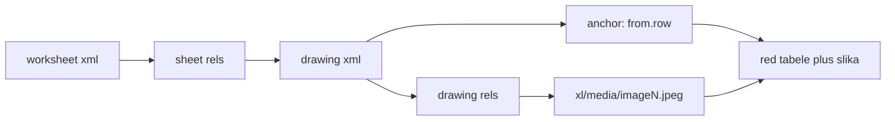

# Klasifikacija slika odeće: kategorija, podkategorija i boja

Projektna dokumentacija — Mašinsko učenje

**Tim:** Irina Marko (1134/2025), Nikola Lazarević (mi251043)
**Mentor:** Lucija Miličić
**Podaci:** Fashion Company — order form Excel fajlovi (Guess, Guess Kids, Guess Footwear, Guess Handbags, Marciano, Levi's, Hugo Boss)

---

## 1. Cilj projekta

Na osnovu slike artikla predvideti:

1. **kategoriju** (npr. Tops, Bottoms, Outerwear, Bags)
2. **podkategoriju** (npr. Hoodie, Jeans, Jacket, Handbag)
3. **boju** (porodica boje: Black, Blue, Red...)

Dodatni zahtev mentora: pored klasičnog pristupa sa vežbi (sopstveni CNN),
istražiti i **transfer learning** i uporediti rezultate.

To znači tri odvojena klasifikaciona zadatka nad istim skupom slika,
svaki višeklasni (multi-class, jedna labela po slici).

---

## 2. Izvorni podaci

Projekat ne koristi javni dataset. Podaci su interni Fashion Company order form-ovi,
gde svaki red predstavlja jedan artikal, a **slika se nalazi u ćeliji Excel tabele**.

```
ML- projekat/
├── exceli/     17 order form fajlova (Guess, Levi's, Boss, Marciano, Premiata...)
├── pravila/    Item Tree.xlsx, Paleta Fashion Company boja.xlsx
└── slike/      422 male slike (uzorak, NIJE korišćen za treniranje)
```

### 2.1 Zašto slike nisu čitane iz foldera `slike/`

Folder `slike/` sadrži samo 422 male slike koje su prvobitno poslate kao uzorak.
Pravi izvor su Excel fajlovi — na primer, samo Guess `W` sheet sadrži **7707**
ugrađenih JPEG slika (150×200 px). Zato je napisan izvlačilac slika iz Excel-a.

### 2.2 Kako su slike izvučene iz Excel-a

`.xlsx` fajl je u suštini ZIP arhiva. Slike žive u `xl/media/`, a njihova veza sa
redom tabele je opisana u `xl/drawings/`. Skripta [scripts/xlsx_images.py](scripts/xlsx_images.py)
prati taj lanac:



Ključna informacija je `anchor._from.row` — broj reda u koji je slika usidrena.
Tako se slika precizno spaja sa metapodacima tog reda (Style, Color, kategorija).

`openpyxl` nam nije bio dovoljan jer u read-only režimu ne izlaže slike, a u
normalnom režimu je za velike fajlove veoma spor, pa se XML čita direktno.

---

## 3. Labeliranje (automatsko, bez ručnog označavanja)

Labele nisu crtane rukom — izvedene su iz zvaničnih Fashion Company pravila.

### 3.1 Item Tree — kanonske kategorije

[pravila/Item Tree.xlsx](pravila/Item%20Tree.xlsx), sheet `Klasifikacija`, kolone
`Full L4 / L3 / L2`:

| Nivo | Značenje | Uloga u projektu |
|---|---|---|
| L2 | Division | filter (Apparel, Footware, Accesories) |
| L3 | Product Family | **`category`** |
| L4 | Product Type | **`subcategory`** |

Prevodi na srpski/hrvatski/slovenački/makedonski/albanski su **ignorisani** —
koriste se samo engleski nazivi, kako je i dogovoreno.

Rezultat: **25 kategorija, 105 parova kategorija–podkategorija**
(fajlovi `data/item_tree.json` i `data/item_tree.csv`).

### 3.2 Paleta boja

[pravila/Paleta Fashion Company boja.xlsx](pravila/Paleta%20Fashion%20Company%20boja.xlsx)
daje **98 nijansi** grupisanih u **13 porodica**: Black, White, Grey, Blue, Green,
Red, Pink, Purple, Yellow, Orange, Brown, Neutral, Multicolor.

Za model se koristi **porodica boje** (13 klasa je izvodljivo), a tačno ime nijanse
(`color_name`) ostaje u CSV-u za kasniju analizu.

### 3.3 Mapiranje vendor polja na pravila

Problem: svaki brend opisuje artikal drugačije. Zato je u
[scripts/label_map.py](scripts/label_map.py) napisano mapiranje po izvoru.

**Kategorija — tri nivoa, prvi koji uspe:**

1. **Ključne reči iz naziva artikla** (`Part Desc`, `GH2 Desc`) — najprecizniji signal
   `PUFFER`, `BOMBER`, `SHEARLING` → Jacket · `TEE` → T-shirt · `SWTR` → Knit sweater
   · `TURTLE`, `MOCK NK` → Roll-neck · `SATCHEL`, `CLUTCH`, `HOBO` → Handbag
2. **Vendor kategorija** (`GH1 Desc`) kao fallback
   `DENIM PANTS` → Jeans · `SKIRTS` → Skirt · `WALLETS` → Wallets
3. Brend-specifične tabele:
   - Levi's ima gotove kolone `Category` / `SubCategory` (`Jeans`, `Tees`, `Truckers`...)
   - Hugo Boss ima `MPG` / `SPG` (`Jersey`, `Knitwear`, `Jersey Tops`...)

**Boja — četiri nivoa:**

1. Levi's `Color Family` direktno (`Blacks` → Black, `Dark Indigo - Worn In` → Blue)
2. Tačno ime iz palete (`Jet Black A996` → `Jet Black` → Black)
3. Ključne reči za porodicu (`CHOCOLATE BROWNIE` → Brown, `SMART BLUE` → Blue)
4. Šifra boje (`JBLK` → Black, `BLA` → Black)

Šifre tipa `A996` i prefiksi tipa `001-` se skidaju pre poklapanja.

### 3.4 Deduplikacija

Jedan artikal se u Excel-u pojavljuje jednom **po veličini** (S, M, L...), a slika je
uvek ista. Zato se čuva samo jedan primer po `(Style, Color)`.

Primer: Guess ima 13 639 redova → **1780** jedinstvenih artikala sa slikom.

Takođe su preskočeni order form-ovi koji dupliraju iste SKU-ove kao WLCEE sheet
(Marciano/FTW/HB order form), da se ista slika ne pojavi dva puta u skupu.

### 3.5 Rezultat labeliranja

**6742 slike, 0 neuparenih** (`dataset/labels.csv`, `dataset/images/`, `dataset/summary.txt`)

| Division | Broj slika |
|---|---|
| Apparel | 4605 |
| Accesories | 1734 |
| Footware | 403 |

Po izvoru:

| Excel | Slika |
|---|---|
| Guess WLCEE | 1780 |
| Guess Kids | 1732 |
| Guess Handbags | 1336 |
| Levi's | 862 |
| Guess Footwear | 394 |
| Marciano | 344 |
| Hugo Boss HWR | 234 |
| Hugo Boss BMG | 60 |

Struktura `labels.csv`:

```
image_path, style, color_code, color_desc, color_name, color_family,
vendor_gh1, part_desc, category, subcategory, match_confidence,
source_file, sheet, gender, category_source, color_source, division
```

Kolona `match_confidence` beleži koliko je labela sigurna:
`high` (ključna reč + tačno ime boje), `medium`, `low` (nema boje).
`category_source` i `color_source` govore **koje pravilo** je pogodilo — korisno za
proveru i za pisanje rada.

**Poznato ograničenje:** 567 slika ima kategoriju, ali ne i `color_family`, jer su
imena boja čisto marketinška (`NIGHTSHINE`, `PLANTER`, `EARTHENWARE`). Te slike se
koriste za kategoriju, ali su izbačene iz zadatka za boju.

**Premiata** nije uključen — taj Excel nije tabela artikala, nego formular za
naručivanje po veličinama, pa nema kolone koje bi se mogle automatski mapirati.

---

## 4. Podela na train / val / test

Skripta [scripts/04_split_dataset.py](scripts/04_split_dataset.py),
podela **70% / 15% / 15%**, **stratifikovano** po labeli, `seed=42`.

Stratifikacija je obavezna jer su klase jako neuravnotežene (Black 1794 vs Yellow 59) —
slučajna podela bi lako ostavila retku klasu bez ijednog primera u testu.

Klase sa premalo primera su izbačene, jer se ne mogu ni trenirati ni pošteno oceniti:

| Zadatak | Klasa | Min primera | Slika | train / val / test |
|---|---|---|---|---|
| `category` | 14 | 20 | 6720 | 4704 / 1007 / 1009 |
| `subcategory` | 30 | 30 | 6476 | 4533 / 971 / 972 |
| `color` | 12 | 20 | 6160 | 4312 / 923 / 925 |

Izbačeno iz `category`: Underwear (12), Suits & Sets (5), Slippers (3), Sandals (2).
Izbačeno iz `color`: Orange (15).
Iz `subcategory` je izbačeno 23 retke klase (Parka 1, Bermudas 1, Maxi dress 2...).

Izlaz: `dataset/splits/*.csv` + `split_report.txt` / `split_report.json`.

---

## 5. Modeli

[scripts/05_train_models.py](scripts/05_train_models.py) trenira **dva modela nad istim
podelama**, da poređenje bude pošteno. Framework: PyTorch (CPU).

### 5.1 Model A — sopstveni CNN ("scratch", pristup sa vežbi)

Konvolutivna mreža napisana od nule, po šablonu sa vežbi:
`Conv → BatchNorm → ReLU → MaxPool`, četiri puta, pa potpuno povezani deo.

```
ulaz 3 × 128 × 128
 ├─ Conv 3→32   + BN + ReLU + MaxPool  →  32 × 64 × 64
 ├─ Conv 32→64  + BN + ReLU + MaxPool  →  64 × 32 × 32
 ├─ Conv 64→128 + BN + ReLU + MaxPool  → 128 × 16 × 16
 ├─ Conv 128→256+ BN + ReLU + MaxPool  → 256 ×  8 ×  8
 └─ Flatten → Dropout 0.5 → Linear 16384→256 → ReLU → Dropout 0.3 → Linear 256→14
```

Šta koji sloj radi:

- **Conv2d** — uči filtere (prvi slojevi ivice i teksture, dublji oblike: kragna, pertla, kopča)
- **BatchNorm2d** — normalizuje aktivacije, ubrzava i stabilizuje treniranje
- **ReLU** — nelinearnost, bez nje bi cela mreža bila jedna linearna funkcija
- **MaxPool2d** — prepolovljava rezoluciju, širi vidno polje sledećeg sloja
- **Dropout** — na slučajno gasi neurone tokom treniranja, protiv preprilagođavanja

**Parametri: 4 587 534, svi se uče.** Mreža počinje od slučajnih vrednosti i sve mora
naučiti isključivo iz naših 4704 slike.

Treniranje: Adam, `lr=1e-3`, `weight_decay=1e-4`, do 10 epoha.

### 5.2 Model B — transfer learning (ResNet18, ImageNet)

Uzima se **ResNet18 već istreniran na ImageNet-u** (1.2 miliona slika, 1000 klasa).
Mreža je već naučila opšte vizuelne pojmove: ivice, teksture, oblike, materijale.

```python
model = models.resnet18(weights=models.ResNet18_Weights.IMAGENET1K_V1)
for param in model.parameters():
    param.requires_grad = False          # zamrzni sve naučeno
model.fc = nn.Linear(model.fc.in_features, n_classes)   # novi izlazni sloj
```

Postupak:

1. učitaju se pretrenirani parametri
2. **svi slojevi se zamrznu** (`requires_grad = False`) — ostaju kao ekstraktor obeležja
3. poslednji sloj (`fc`), koji je davao 1000 ImageNet klasa, zamenjuje se novim
   slojem sa 14 izlaza (naše kategorije)
4. trenira se **samo taj novi sloj**

**Parametri: 11 183 694 ukupno, ali samo 7182 se uče** — ostalih 11.18 miliona je
zamrznuto. Zato je jedna epoha brža i, što je važnije, model se ne preprilagođava
uprkos malom skupu.

Treniranje: Adam, `lr=1e-3`, samo `model.fc` parametri, do 6 epoha.

### 5.3 Direktno poređenje

| | Scratch CNN | Transfer (ResNet18) |
|---|---|---|
| Odakle počinje | slučajne vrednosti | znanje sa ImageNet-a |
| Ukupno parametara | 4.59 M | 11.18 M |
| **Parametara koji se uče** | **4.59 M** | **7 182** |
| Slojeva u dubinu | 4 konv. bloka | 18 slojeva (rezidualni) |
| Potreban broj slika | veliki | mali |
| Rizik od preprilagođavanja | visok | nizak |
| Epoha | 10 | 6 |

### 5.4 Zajednički postupak treniranja

Isto za oba modela, da razlika u rezultatu dolazi samo od arhitekture:

- **Slike:** skaliranje na 128×128, normalizacija ImageNet srednjim vrednostima
- **Augmentacija (samo train):** slučajno horizontalno okretanje,
  `ColorJitter` sa malim intenzitetom 0.15
  *(namerno slab jitter — jak bi pokvario zadatak prepoznavanja boje)*
- **Neuravnoteženost klasa:** `CrossEntropyLoss` sa `class_weight='balanced'`,
  pa retke klase (Court shoes 34 slike) nisu pregažene čestim (Tops 1050)
- **Early stopping:** prati se **val macro-F1**, `patience=3`, čuva se najbolji checkpoint
- **Metrika:** accuracy, **macro-F1** i weighted-F1

Zašto macro-F1 kao glavna metrika: accuracy je obmanjujuća kod neuravnoteženih klasa.
Model koji bi svaku sliku proglasio za Tops imao bi ~22% accuracy, ali katastrofalan
macro-F1. Macro-F1 gleda svaku klasu jednako, bez obzira na broj primera.

---

## 6. Rezultati

Sva tri zadatka su istrenirana oba modela, nad istim podelama (`results/comparison.csv`):

| Zadatak | Klasa | Model | Accuracy | Macro-F1 | Weighted-F1 |
|---|---|---|---|---|---|
| category | 14 | Scratch CNN | 0.642 | 0.622 | 0.641 |
| category | 14 | **Transfer** | **0.736** | **0.762** | **0.738** |
| subcategory | 30 | Scratch CNN | 0.480 | 0.429 | 0.479 |
| subcategory | 30 | **Transfer** | **0.656** | **0.604** | **0.667** |
| color | 12 | **Scratch CNN** | **0.671** | **0.514** | **0.654** |
| color | 12 | Transfer | 0.594 | 0.504 | 0.598 |

Glavni nalaz: **transfer learning jasno pobeđuje na zadacima oblika (category,
subcategory), ali gubi na boji.** To nije slučajnost, nego direktna posledica onoga
što ImageNet obeležja jesu — vidi 6.3.

### 6.1 Kategorija (14 klasa, test 1009 slika)

Transfer je bolji za **+9.4 pp accuracy i +0.140 macro-F1**, uz 640× manje parametara
koji se uče.

Tok treniranja:

| Epoha | Scratch val macro-F1 | Transfer val macro-F1 |
|---|---|---|
| 1 | 0.407 | 0.661 |
| 2 | 0.549 | 0.698 |
| 3 | 0.572 | 0.754 |
| 4 | 0.657 | 0.749 |
| 5 | 0.721 | 0.762 |
| 6 | 0.665 | 0.762 |
| 7 | 0.708 | — |
| 8 | 0.698 (early stop) | — |

Transfer model već **posle jedne epohe** (0.661) prestiže ono što scratch dostiže
tek u petoj (0.721 je njegov maksimum). To je vrednost pretreniranih obeležja.

Po klasama (transfer model):

| Klasa | F1 | Test primera |
|---|---|---|
| Court shoes | 1.000 | 7 |
| Boots | 0.930 | 23 |
| Bottoms | 0.878 | 147 |
| Small Leather Goods | 0.873 | 33 |
| Bags | 0.821 | 119 |
| Sneakers | 0.800 | 26 |
| Shoes | 0.800 | 3 |
| Belts | 0.769 | 21 |
| T-shirt | 0.759 | 148 |
| Soft Accessories | 0.741 | 70 |
| Outerwear | 0.664 | 116 |
| Tops | 0.631 | 225 |
| Dresses | 0.579 | 54 |
| Other Accessories | 0.429 | 17 |

Zapažanja:

- **Obuća i torbe se prepoznaju odlično** — vizuelno su vrlo različite od odeće
- **Tops / T-shirt / Outerwear se mešaju**, što je i očekivano: na slici je razlika
  između majice, tanke bluze i lagane jakne ponekad nevidljiva, a granica u Item
  Tree-u je delom poslovna, ne vizuelna
- **Other Accessories** je najslabija klasa jer je po definiciji "sve ostalo" —
  nema zajednički vizuelni obrazac
- Scratch model potpuno pada na retkim klasama (Shoes F1 = 0.000,
  Other Accessories F1 = 0.074), dok transfer i tamo daje 0.800 / 0.429

### 6.2 Podkategorija (30 klasa, test 972 slike)

Najteži zadatak — dvostruko više klasa, a mnoge su vizuelno skoro identične.

| Model | Accuracy | Macro-F1 |
|---|---|---|
| Scratch CNN | 0.480 | 0.429 |
| **Transfer** | **0.656** | **0.604** |

Ovde je prednost transfer learning-a **najveća: +17.6 pp accuracy i +0.175 macro-F1.**
Logično — što je zadatak finiji, to su potrebnija bogatija obeležja, a 4533 slike za
treniranje nikako nisu dovoljne da se 30 klasa nauči od nule.

Najbolje i najgore klase (transfer):

| Najbolje | F1 | | Najgore | F1 | Primera |
|---|---|---|---|---|---|
| Boots | 0.979 | | Caps | 0.250 | 7 |
| Court shoes | 0.933 | | Blazer | 0.286 | 9 |
| Sneakers | 0.929 | | Cardigan | 0.293 | 14 |
| Belts | 0.894 | | Top | 0.304 | 33 |
| Handbag | 0.874 | | Hoodie | 0.326 | 15 |
| Wallets | 0.866 | | Coat | 0.372 | 10 |
| Jeans | 0.838 | | Blouse | 0.375 | 6 |
| Trousers | 0.826 | | Body | 0.400 | 4 |

Obrazac je jasan: **jedinstveni oblici se prepoznaju odlično** (obuća, torbe, kaiševi,
pantalone), a **varijante gornjeg dela se mešaju** (Top / Blouse / T-shirt / Shirt,
Hoodie / Sweatshirt, Blazer / Jacket / Coat, Cardigan / Knit sweater). Razlika između
duksa i duksa sa kapuljačom je jedan detalj na slici od 128 px.

Scratch model na najtežim klasama potpuno pada — `Cardigan` i `Polo shirt` imaju
**F1 = 0.000** (nijedna tačna predikcija), `Shirt` 0.085, `Jacket` 0.135. Transfer i
tamo daje 0.293 / 0.414 / 0.484 / 0.496.

### 6.3 Boja (12 klasa, test 925 slika) — jedini zadatak gde scratch pobeđuje

| Model | Accuracy | Macro-F1 |
|---|---|---|
| **Scratch CNN** | **0.671** | **0.514** |
| Transfer | 0.594 | 0.504 |

**Ovo je najzanimljiviji rezultat projekta.** Objašnjenje: ResNet18 je na ImageNet-u
treniran da prepoznaje *šta* je objekat, a identitet objekta je uglavnom nezavisan od
boje — pas je pas i kad je crn i kad je beo. Mreža je zato naučila da boju delom
**ignoriše** kao nebitnu smetnju, i gradi obeležja osetljiva na oblik i teksturu.

Kad ta obeležja zamrznemo, informacija koja nam je za boju jedina važna je već
izgubljena pre poslednjeg sloja. Scratch CNN uči od nule na našim slikama, pa slobodno
gradi filtere osetljive na boju.

Ovo je i praktičan zaključak: **transfer learning nije univerzalno bolji** — bolji je
kada se zadatak poklapa sa onim što je pretrenirana mreža naučila.

Po klasama:

| Klasa | Scratch F1 | Transfer F1 | Primera |
|---|---|---|---|
| Black | **0.851** | 0.751 | 269 |
| Blue | **0.766** | 0.641 | 141 |
| Red | **0.773** | 0.737 | 55 |
| Brown | **0.720** | 0.527 | 86 |
| White | **0.682** | 0.652 | 103 |
| Green | **0.578** | 0.404 | 48 |
| Purple | 0.475 | **0.500** | 19 |
| Neutral | 0.347 | **0.378** | 70 |
| Grey | 0.325 | **0.358** | 44 |
| Pink | 0.316 | **0.463** | 38 |
| Yellow | **0.258** | 0.235 | 9 |
| Multicolor | 0.078 | **0.400** | 43 |

Scratch je bolji na **jasnim, čistim bojama** (Black, Blue, Brown, Green, Red) — tamo
gde je dovoljno gledati dominantnu nijansu. Transfer je bolji na **Multicolor**
(0.400 vs 0.078) i **Pink**, jer Multicolor nije boja nego *obrazac* (šara, print),
a to je upravo ono što ImageNet obeležja dobro vide. Scratch model Multicolor skoro
uopšte ne prepoznaje (recall 0.047).

Boja je uz to najteži zadatak po macro-F1 (~0.51 kod oba modela), iz tri razloga:

1. `Grey` / `Neutral` / `White` se realno preklapaju i u samoj paleti (beige, cream, ecru)
2. slika sadrži i model i pozadinu, ne samo artikal, pa dominantna boja slike nije
   uvek boja artikla
3. `ColorJitter` augmentacija, iako slaba (0.15), ovom zadatku odmaže

---

## 7. Struktura projekta

```
ML- projekat/
├── exceli/                     ulazni Excel fajlovi
├── pravila/                    Item Tree + paleta boja
├── scripts/
│   ├── 01_parse_rules.py       Item Tree + paleta  →  data/*.json
│   ├── xlsx_images.py          izvlačenje slika iz .xlsx (red ↔ slika)
│   ├── label_map.py            pravila mapiranja (vendor → Item Tree, boje)
│   ├── 02_label_guess.py       labeliranje Guess apparel (prvi korak)
│   ├── 03_label_sources.py     labeliranje svih ostalih brendova + spajanje
│   ├── 04_split_dataset.py     stratifikovana podela train/val/test
│   └── 05_train_models.py      scratch CNN + transfer learning + poređenje
├── data/                       item_tree.json, color_palette.json (+ .csv)
├── dataset/
│   ├── images/                 6742 izvučene slike
│   ├── labels.csv              finalne labele
│   ├── unmatched.csv           neupareni redovi (trenutno prazno)
│   ├── summary.txt             statistika labeliranja
│   └── splits/                 train/val/test CSV + split_report
├── models/                     najbolji checkpointi (.pt)
├── results/                    metrike, istorija treniranja, grafici
└── requirements.txt
```

### Redosled pokretanja

```bash
pip install -r requirements.txt

python scripts/01_parse_rules.py      # pravila → JSON
python scripts/02_label_guess.py      # Guess apparel
python scripts/03_label_sources.py    # ostali brendovi, spajanje u labels.csv
python scripts/04_split_dataset.py    # train/val/test
python scripts/05_train_models.py     # treniranje i poređenje
```

---

## 8. Zaključci

1. **Automatsko labeliranje iz poslovnih pravila je uspelo.** 6742 slike su dobile
   kategoriju, podkategoriju i boju bez ručnog označavanja, sa 0 neuparenih redova.
   Ključ je bio kombinovanje ključnih reči iz naziva artikla sa vendor kategorijom.

2. **Transfer learning pobeđuje na zadacima oblika, i to izraženije što je zadatak
   finiji.** Na kategoriji +0.140 macro-F1, na podkategoriji +0.175, uz 640× manje
   parametara koji se uče. Razlog je veličina skupa — 4500–4700 slika nije dovoljno da
   mreža od nule nauči dobra vizuelna obeležja, a ImageNet obeležja su već dobra i
   treba im samo novi klasifikator. Transfer model već posle **prve epohe** prestiže
   ono što scratch dostigne posle pet.

3. **Transfer learning nije univerzalno bolji — na boji gubi** (0.671 vs 0.594
   accuracy u korist scratch CNN-a). ImageNet obeležja su naučena da boju delom
   ignorišu, jer identitet objekta ne zavisi od boje. Kad ih zamrznemo, izgubimo baš
   onu informaciju koja nam je za ovaj zadatak jedina potrebna. Zaključak: pretrenirana
   obeležja pomažu samo kada se novi zadatak poklapa sa onim što je mreža naučila.

4. **Kvalitet labela ograničava tačnost.** Item Tree je poslovna, ne vizuelna
   klasifikacija. Granica Tops / T-shirt / Outerwear ili Hoodie / Sweatshirt nije uvek
   vidljiva na slici, pa te klase ostaju najslabije bez obzira na model.

5. **Neuravnoteženost je glavni tehnički problem.** Odnos najčešće i najređe klase je
   preko 750:1 pre filtriranja. Rešeno kombinacijom minimalnog broja primera po klasi,
   stratifikovane podele, class weights i macro-F1 kao metrike.

### Predlozi za dalji rad

- **fine-tuning** celog ResNet-a sa malim `lr` (npr. `1e-4`), a ne samo poslednjeg sloja —
  ovo bi verovatno rešilo i slabost transfer modela na boji, jer bi se i konvolutivni
  slojevi prilagodili zadatku
- **za boju odbaciti `ColorJitter`** augmentaciju i istrenirati ponovo; ona ovom zadatku
  po definiciji odmaže
- probati jači model (ResNet50, EfficientNet) i veću rezoluciju od 128 px
- **hijerarhijska klasifikacija**: prvo kategorija, pa podkategorija unutar nje —
  smisleno jer podkategorija ima 30 klasa i mnogo retkih
- za boju probati i klasičan pristup bez CNN-a (histogram u HSV prostoru) kao osnovu za poređenje
- doraditi mapiranje 567 slika kojima nije prepoznata boja

---

## 9. Literatura

1. He, K., Zhang, X., Ren, S., Sun, J. (2016). *Deep Residual Learning for Image Recognition*. CVPR. https://arxiv.org/abs/1512.03385
2. Deng, J. et al. (2009). *ImageNet: A Large-Scale Hierarchical Image Database*. CVPR.
3. Goodfellow, I., Bengio, Y., Courville, A. (2016). *Deep Learning*. MIT Press.
4. PyTorch transfer learning tutorial: https://pytorch.org/tutorials/beginner/transfer_learning_tutorial.html
5. Materijali i vežbe sa predmeta Mašinsko učenje (CNN klasifikacija).
6. Fashion Company: Item Tree i paleta boja (interni dokumenti za labeliranje).
